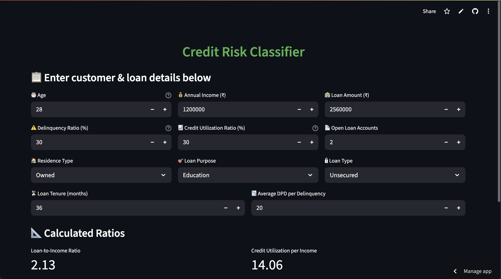

# Credit_risk_classifier

An interactive Streamlit app that predicts credit risk categories (Poor, Average, Good, Excellent) based on borrower profiles, bureau data, and loan details using machine learning.

Live Demo - https://prajwal-glitch-credit-risk-classifier-appmain-1mzyat.streamlit.app/




## Tools & Technologies

- Python, Streamlit  
- pandas, numpy, seaborn, matplotlib  
- scikit-learn, xgboost, statsmodels

## Setup

Clone the repository and change the directory to downloaded repository. Run the following commands - 

```bash
pip3 install -r requirements.txt
streamlit run main.py
